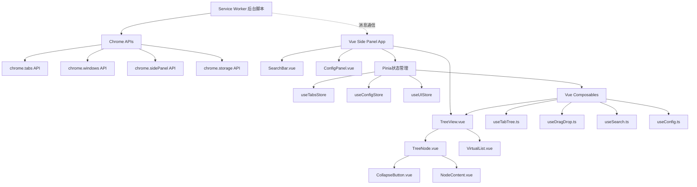
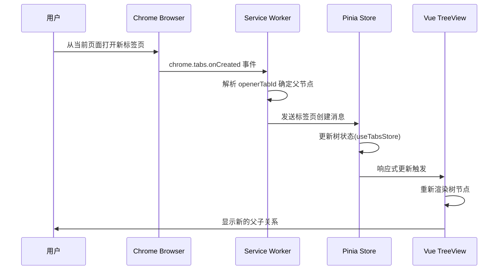
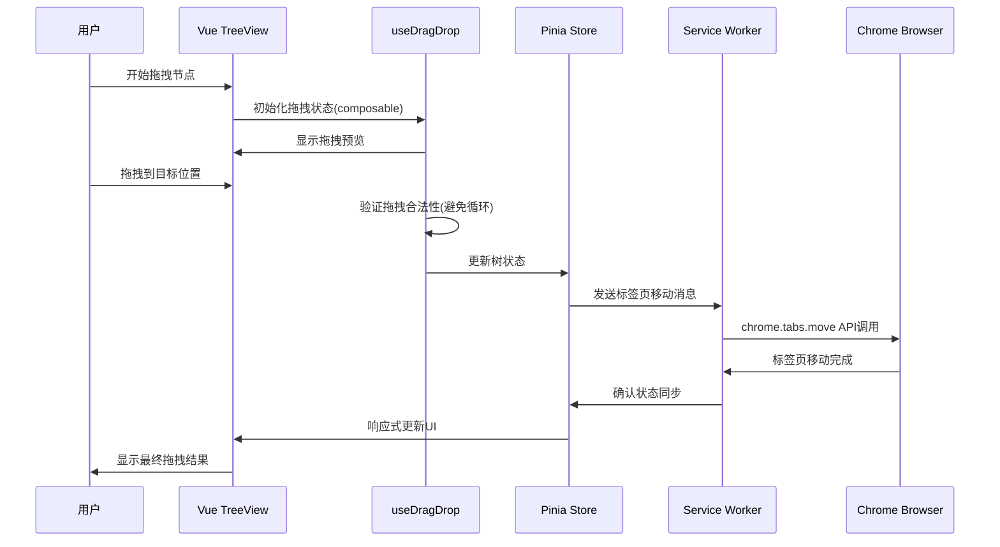
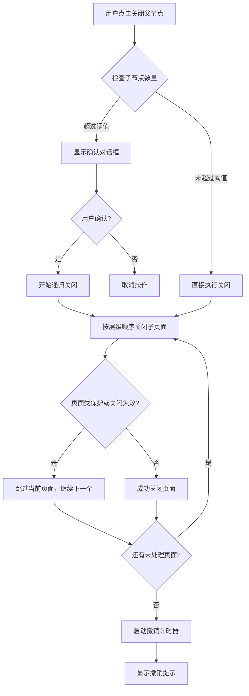
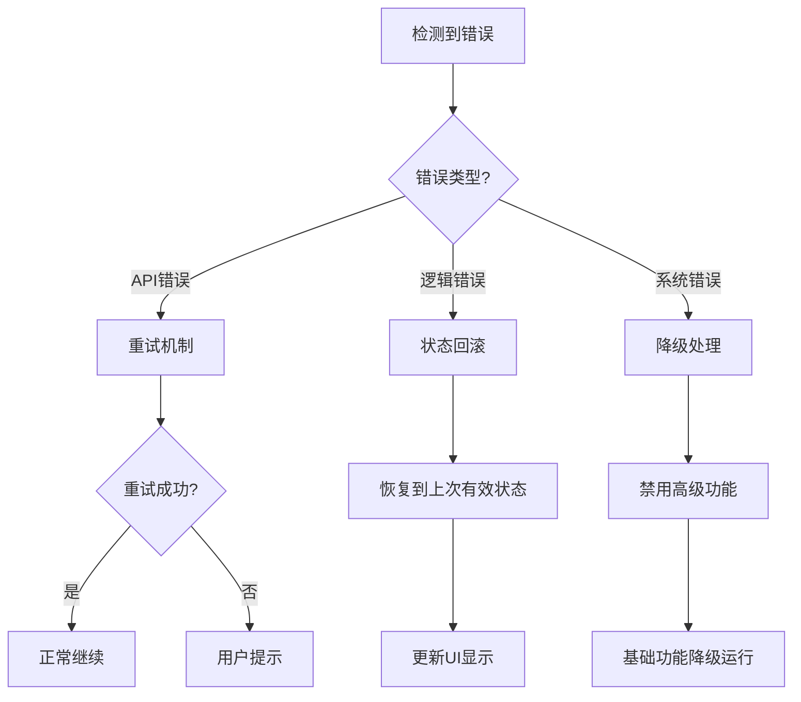

# 技术设计文档

## 概述

Chrome树状标签管理器是一个基于Manifest V3的Chrome浏览器扩展插件，通过左侧面板提供树状结构展示和管理所有打开的标签页。该插件自动维护页面间的父子关系，支持折叠/展开、拖拽重组、智能关闭、搜索过滤等高级管理功能，并通过配置页面提供高度自定义选项。

**目标用户**: 需要高效管理大量标签页的Chrome用户，特别是开发人员、研究人员和重度浏览器使用者。

**核心价值**: 通过可视化的树状层级结构替代传统的线性标签页排列，显著提升多标签页管理效率，减少认知负担，并提供智能批量操作功能。

### 目标

- 提供直观的树状结构界面展示标签页层级关系
- 实现高性能的拖拽重组和虚拟滚动支持1000+标签页
- 保持与Chrome原生标签页系统的完全同步
- 提供配置灵活的用户自定义选项和智能批量操作

### 非目标

- 不替代Chrome原生标签页功能，仅作为辅助管理工具
- 不涉及标签页内容的修改或注入
- 不提供跨浏览器兼容性（专注于Chrome优化）

## 架构

### 高层架构



### 技术栈和设计决策

**前端技术栈**:
- **Vue 3.x**: 采用Composition API的现代Vue框架
- **TypeScript**: 强类型JavaScript提供代码可维护性和类型安全
- **Pinia**: Vue3推荐的状态管理库
- **Vite**: 快速的构建工具和开发服务器
- **Chrome Extension APIs**: Manifest V3 service worker架构

**关键设计决策**:

**决策1: 采用Chrome Side Panel API而非传统PopUp**
- **上下文**: 需要持久性的左侧面板界面，用户在不同标签页间切换时保持状态
- **替代方案**: Action popup（会自动关闭）、Content script注入（兼容性问题）、Devtools panel（仅开发场景）
- **选择方案**: Side Panel API提供原生左侧面板集成
- **理由**: 2025年Chrome的Side Panel API提供最佳用户体验，支持持久状态、原生UI集成、无需权限申请
- **权衡**: 限制为Chrome 114+版本，但获得更好的性能和用户体验

**决策2: Vue3 Composition API + Pinia状态管理**
- **上下文**: 需要构建复杂的响应式UI和状态管理系统
- **替代方案**: 传统的Options API或原生JavaScript状态管理
- **选择方案**: Vue3 Composition API配合Pinia进行状态管理
- **理由**: 提供更好的逻辑复用、类型安全和开发体验，与项目技术标准一致
- **权衡**: 需要学习Vue3新特性，但获得更强的可维护性和开发效率

**决策3: 简化的Service Worker + Composables架构**
- **上下文**: 需要在扩展后台和Vue UI之间建立通信
- **替代方案**: 复杂的多层架构或直接API调用
- **选择方案**: 轻量化Service Worker配合Vue composables处理业务逻辑
- **理由**: 符合项目架构标准，降低复杂度，利用Vue生态系统优势
- **权衡**: 部分逻辑移至前端处理，但获得更好的可测试性和维护性

## 系统流程

### 标签页创建和父子关系建立流程



### 拖拽重组操作流程



### 智能关闭递归流程



## 需求可追溯性

| 需求 | 需求摘要 | 实现组件 | 关键接口 | 相关流程 |
|------|----------|----------|----------|----------|
| 1.1-1.6 | 树状结构展示 | Tree Renderer, Node Components | TreeRenderer.render(), NodeComponent.createElement() | 初始化渲染流程 |
| 2.1-2.4 | 父子关系管理 | Parent-Child Tracker, Tree State Manager | TabRelationTracker.trackParentChild() | 标签页创建流程 |
| 3.1-3.5 | 折叠展开功能 | Node Components, Tree State Manager | NodeComponent.toggleCollapse() | 节点交互流程 |
| 4.1-4.5 | 拖拽重组功能 | Drag & Drop Engine | DragDropEngine.handleDrag() | 拖拽重组流程 |
| 5.1-5.5 | 智能关闭行为 | Tree Actions Handler | TreeActions.closeWithChildren() | 智能关闭流程 |
| 6.1-6.4 | 跨窗口管理 | Window Manager, Tree State Manager | WindowManager.handleWindowChange() | 窗口管理流程 |
| 7.1-7.5 | 搜索过滤功能 | Search & Filter Engine | SearchEngine.search() | 搜索过滤流程 |
| 8.1-8.6 | 配置管理 | Configuration Manager, Configuration UI | ConfigManager.updateSettings() | 配置更新流程 |
| 9.1-9.6 | 用户交互功能 | Event Handler, UI Controller | EventHandler.handleNodeClick() | 用户交互流程 |
| 10.1-10.5 | 页面定位功能 | Auto Locator, Virtual Scroller | AutoLocator.scrollToTab() | 页面定位流程 |

## 组件和接口

### Chrome Extension 层

#### Extension Manifest
**主要职责**: 定义扩展权限、API访问和入口点配置
**领域边界**: Chrome扩展系统集成层
**依赖关系**:
- **入站**: Chrome Extension Platform
- **出站**: Service Worker, Side Panel HTML
- **外部**: Chrome APIs (tabs, windows, sidePanel, storage)

#### Service Worker (Background Script)
**主要职责**: 轻量化的事件监听和消息转发，避免复杂的业务逻辑处理
**领域边界**: 扩展生命周期管理和API事件转发层
**数据所有权**: 仅处理Chrome API事件，不维护复杂状态

**依赖关系**:
- **入站**: Vue Side Panel (通过 chrome.runtime.sendMessage)
- **出站**: Chrome Extension APIs
- **外部**: Chrome tabs, windows, storage APIs

**简化服务接口**:
```typescript
interface ServiceWorkerAPI {
  // 事件转发（不处理复杂逻辑）
  forwardTabEvent(event: TabEvent): Promise<void>;
  forwardWindowEvent(event: WindowEvent): Promise<void>;

  // 简单的API代理
  executeTabAction(action: TabAction): Promise<TabActionResult>;
  getStorageData(key: string): Promise<unknown>;
  setStorageData(key: string, data: unknown): Promise<void>;
}

interface TabEvent {
  type: 'created' | 'removed' | 'moved' | 'activated' | 'updated';
  tab: chrome.tabs.Tab;
  changeInfo?: chrome.tabs.TabChangeInfo;
}

interface TabAction {
  type: 'move' | 'close' | 'create' | 'group';
  tabId: number;
  params: Record<string, unknown>;
}
```

**事件处理策略**:
- **事件转发**: 将Chrome API事件转发给Vue应用处理
- **API代理**: 为Vue应用提供Chrome API访问代理
- **轻量化**: 避免在Service Worker中进行复杂的状态管理

### Vue状态管理层

#### Pinia Stores
**主要职责**: 使用Pinia管理应用的响应式状态，遵循Vue生态系统最佳实践
**领域边界**: 状态管理和业务逻辑层
**数据所有权**: 树状结构数据、UI状态、用户配置

**依赖关系**:
- **入站**: Vue组件、Composables
- **出站**: Chrome API (通过Service Worker)、Chrome Storage
- **外部**: Pinia响应式系统

#### useTabsStore (标签页状态管理)
```typescript
// stores/tabs.ts
export const useTabsStore = defineStore('tabs', () => {
  // State
  const tabTree = ref<TabTreeNode[]>([]);
  const activeTabId = ref<number | null>(null);
  const windowGroups = ref<Map<number, TabTreeNode[]>>(new Map());

  // Getters
  const flattenedTabs = computed(() => flattenTree(tabTree.value));
  const activeTab = computed(() =>
    flattenedTabs.value.find(tab => tab.tabId === activeTabId.value)
  );
  const rootNodes = computed(() =>
    tabTree.value.filter(node => !node.parentId)
  );

  // Actions
  const addTab = (tab: TabInfo, parentId?: string) => {
    const newNode = createTabNode(tab, parentId);
    if (parentId) {
      addChildToParent(newNode, parentId);
    } else {
      tabTree.value.push(newNode);
    }
  };

  const removeTab = (tabId: number) => {
    const index = findTabIndex(tabTree.value, tabId);
    if (index !== -1) {
      tabTree.value.splice(index, 1);
    }
  };

  const moveTab = (tabId: number, newParentId?: string, index?: number) => {
    // Vue响应式移动逻辑
  };

  return {
    // State
    tabTree: readonly(tabTree),
    activeTabId: readonly(activeTabId),
    windowGroups: readonly(windowGroups),

    // Getters
    flattenedTabs,
    activeTab,
    rootNodes,

    // Actions
    addTab,
    removeTab,
    moveTab
  };
});
```

#### useConfigStore (配置状态管理)
```typescript
// stores/config.ts
export const useConfigStore = defineStore('config', () => {
  const config = ref<ExtensionConfig>({
    panelWidth: 300,
    panelVisible: true,
    showFavicons: true,
    confirmThreshold: 5,
    enableVirtualScroll: true,
    // ... 其他配置项
  });

  const updateConfig = async (updates: Partial<ExtensionConfig>) => {
    Object.assign(config.value, updates);
    await saveConfigToStorage(config.value);
  };

  const resetConfig = async () => {
    config.value = getDefaultConfig();
    await saveConfigToStorage(config.value);
  };

  return {
    config: readonly(config),
    updateConfig,
    resetConfig
  };
});
```

#### useUIStore (UI状态管理)
```typescript
// stores/ui.ts
export const useUIStore = defineStore('ui', () => {
  const collapsedNodes = ref<Set<string>>(new Set());
  const searchQuery = ref('');
  const selectedNode = ref<string | null>(null);
  const dragState = ref<DragState | null>(null);

  const toggleCollapse = (nodeId: string) => {
    if (collapsedNodes.value.has(nodeId)) {
      collapsedNodes.value.delete(nodeId);
    } else {
      collapsedNodes.value.add(nodeId);
    }
  };

  return {
    collapsedNodes: readonly(collapsedNodes),
    searchQuery,
    selectedNode,
    dragState,
    toggleCollapse
  };
});
```

### Vue组件层

#### TreeView.vue (主树组件)
**主要职责**: 渲染树状结构UI，集成虚拟滚动和交互逻辑
**领域边界**: UI展示和用户交互层
**数据所有权**: 视图状态、滚动位置

**依赖关系**:
- **入站**: App.vue主应用
- **出站**: TreeNode.vue, VirtualList.vue, useTabTree composable
- **外部**: Vue响应式系统、DOM API

**组件接口**:
```vue
<!-- components/TreeView/TreeView.vue -->
<template>
  <div class="tree-view" ref="treeContainer">
    <VirtualList
      :items="visibleNodes"
      :item-height="nodeHeight"
      @scroll="handleScroll"
    >
      <template #default="{ item }">
        <TreeNode
          :node="item"
          :level="item.depth"
          :is-collapsed="isNodeCollapsed(item.id)"
          @toggle-collapse="toggleCollapse"
          @node-click="handleNodeClick"
          @start-drag="handleDragStart"
        />
      </template>
    </VirtualList>
  </div>
</template>

<script setup lang="ts">
import { ref, computed } from 'vue';
import { useTabsStore } from '@/stores/tabs';
import { useUIStore } from '@/stores/ui';
import { useTabTree } from '@/composables/useTabTree';
import TreeNode from './TreeNode.vue';
import VirtualList from '../VirtualList/VirtualList.vue';

// Props
interface Props {
  searchQuery?: string;
  showLines?: boolean;
}
const props = withDefaults(defineProps<Props>(), {
  searchQuery: '',
  showLines: true
});

// Composables
const tabsStore = useTabsStore();
const uiStore = useUIStore();
const { flattenTree, toggleNodeCollapse } = useTabTree();

// Computed
const visibleNodes = computed(() =>
  flattenTree(tabsStore.tabTree).filter(node =>
    !props.searchQuery ||
    node.title.includes(props.searchQuery) ||
    node.url.includes(props.searchQuery)
  )
);
</script>
```

#### TreeNode.vue (树节点组件)
**主要职责**: 单个节点的展示和交互处理
**领域边界**: 节点级UI交互层

```vue
<!-- components/TreeView/TreeNode.vue -->
<template>
  <div
    class="tree-node"
    :class="{
      'is-active': node.isActive,
      'is-dragging': isDragging,
      'has-children': hasChildren
    }"
    :style="{ paddingLeft: `${level * 20}px` }"
    @click="$emit('nodeClick', node)"
    draggable="true"
    @dragstart="$emit('startDrag', $event, node)"
  >
    <CollapseButton
      v-if="hasChildren"
      :collapsed="isCollapsed"
      @click.stop="$emit('toggleCollapse', node.id)"
    />

    <NodeContent
      :node="node"
      :show-favicon="showFavicon"
    />
  </div>
</template>

<script setup lang="ts">
interface Props {
  node: TabTreeNode;
  level: number;
  isCollapsed: boolean;
  showFavicon?: boolean;
}

interface Emits {
  nodeClick: [node: TabTreeNode];
  toggleCollapse: [nodeId: string];
  startDrag: [event: DragEvent, node: TabTreeNode];
}

const props = withDefaults(defineProps<Props>(), {
  showFavicon: true
});

const emit = defineEmits<Emits>();

const hasChildren = computed(() => props.node.children.length > 0);
</script>
```

### Vue Composables层

#### useDragDrop.ts (拖拽逻辑组合式API)
**主要职责**: 使用Vue Composition API实现拖拽功能，与Pinia状态管理集成
**领域边界**: 拖拽交互逻辑层

**依赖关系**:
- **入站**: TreeView.vue, TreeNode.vue组件
- **出站**: useTabsStore, useUIStore
- **外部**: SortableJS库, Vue响应式系统

**Composable接口**:
```typescript
// composables/useDragDrop.ts
export function useDragDrop() {
  const tabsStore = useTabsStore();
  const uiStore = useUIStore();

  const dragState = ref<DragState | null>(null);

  interface DragState {
    dragNodeId: string;
    dragElement: HTMLElement;
    startPosition: { x: number; y: number };
    isValid: boolean;
  }

  const startDrag = (event: DragEvent, node: TabTreeNode) => {
    dragState.value = {
      dragNodeId: node.id,
      dragElement: event.target as HTMLElement,
      startPosition: { x: event.clientX, y: event.clientY },
      isValid: true
    };

    // 设置拖拽数据
    event.dataTransfer?.setData('text/plain', node.id);
    uiStore.dragState = dragState.value;
  };

  const handleDrop = (event: DragEvent, targetNode: TabTreeNode) => {
    event.preventDefault();
    const dragNodeId = event.dataTransfer?.getData('text/plain');

    if (dragNodeId && validateDrop(dragNodeId, targetNode.id)) {
      // 使用Pinia store更新状态
      tabsStore.moveTab(parseInt(dragNodeId), targetNode.id);
    }

    // 清理拖拽状态
    dragState.value = null;
    uiStore.dragState = null;
  };

  const validateDrop = (dragNodeId: string, targetNodeId: string): boolean => {
    // 防止循环依赖检查
    return !isAncestorOf(dragNodeId, targetNodeId);
  };

  return {
    dragState: readonly(dragState),
    startDrag,
    handleDrop,
    validateDrop
  };
}
```

#### useTabTree.ts (树逻辑组合式API)
**主要职责**: 树结构操作和业务逻辑的组合式API
**领域边界**: 树操作业务逻辑层

```typescript
// composables/useTabTree.ts
export function useTabTree() {
  const tabsStore = useTabsStore();
  const uiStore = useUIStore();

  const flattenTree = (nodes: TabTreeNode[]): FlattenedNode[] => {
    const result: FlattenedNode[] = [];
    const traverse = (nodes: TabTreeNode[], depth = 0) => {
      for (const node of nodes) {
        result.push({ ...node, depth });
        if (!uiStore.collapsedNodes.has(node.id) && node.children.length > 0) {
          traverse(node.children, depth + 1);
        }
      }
    };
    traverse(nodes);
    return result;
  };

  const toggleNodeCollapse = (nodeId: string) => {
    uiStore.toggleCollapse(nodeId);
  };

  const findNodePath = (nodeId: string): TabTreeNode[] => {
    // 查找节点路径的逻辑
    const path: TabTreeNode[] = [];
    // ... 实现逻辑
    return path;
  };

  const closeNodeWithChildren = async (nodeId: string) => {
    const node = findNode(nodeId);
    if (!node) return;

    // 递归关闭子节点
    const nodesToClose = collectChildNodes(node);

    // 通过Service Worker执行关闭操作
    for (const node of nodesToClose) {
      await sendMessageToBackground({
        type: 'CLOSE_TAB',
        tabId: node.tabId
      });
    }
  };

  return {
    flattenTree,
    toggleNodeCollapse,
    findNodePath,
    closeNodeWithChildren
  };
}
```

#### Virtual Scroller
**主要职责**: 实现虚拟滚动优化，支持大量节点的流畅渲染
**领域边界**: 性能优化层

**依赖关系**:
- **入站**: Tree Renderer
- **出站**: DOM API
- **外部**: Intersection Observer API, RequestAnimationFrame

**服务接口**:
```typescript
interface VirtualScroller {
  // 滚动控制
  initialize(container: HTMLElement, itemHeight: number): void;
  setItems(items: VirtualScrollItem[]): void;
  scrollToItem(itemId: string): Promise<void>;

  // 渲染优化
  getVisibleRange(): { start: number; end: number };
  updateViewport(): void;

  // 配置
  setBuffer(bufferSize: number): void;
  setItemHeight(height: number): void;
}

interface VirtualScrollItem {
  id: string;
  height: number;
  data: TreeNode;
  element?: HTMLElement;
}
```

**虚拟滚动优化策略**:
- **视口缓冲**: 上下各缓冲10个节点减少滚动时的闪烁
- **动态高度**: 支持不同节点高度（展开状态、内容长度）
- **平滑滚动**: 使用 requestAnimationFrame 实现60fps滚动

#### Search & Filter Engine
**主要职责**: 实现实时搜索和多条件过滤功能
**领域边界**: 搜索功能层

**依赖关系**:
- **入站**: Search UI, Filter UI
- **出站**: Tree State Manager
- **外部**: Web Workers API（用于大数据集搜索）

**服务接口**:
```typescript
interface SearchFilterEngine {
  // 搜索功能
  search(query: string, options: SearchOptions): Promise<SearchResult[]>;
  clearSearch(): void;

  // 过滤功能
  addFilter(filter: Filter): void;
  removeFilter(filterId: string): void;
  clearAllFilters(): void;

  // 结果处理
  getFilteredNodes(): TreeNode[];
  highlightResults(results: SearchResult[]): void;
}

interface SearchOptions {
  caseSensitive: boolean;
  searchUrl: boolean;
  searchTitle: boolean;
  useRegex: boolean;
}

interface Filter {
  id: string;
  type: 'AUDIO_PLAYING' | 'RECENTLY_ACTIVE' | 'DOMAIN' | 'WINDOW';
  criteria: FilterCriteria;
  enabled: boolean;
}

interface SearchResult {
  nodeId: string;
  matches: Match[];
  score: number;
}

interface Match {
  field: 'title' | 'url';
  start: number;
  end: number;
  text: string;
}
```

## 数据模型

### 域模型

**核心聚合**:

**Tab Tree Aggregate**: 标签页树状结构的事务一致性边界
- **根实体**: TreeRoot - 管理整个树的生命周期
- **实体**: TreeNode - 具有唯一标识的标签页节点
- **值对象**: TabInfo, NodeState, Position
- **域事件**: NodeAdded, NodeRemoved, NodeMoved, TreeRestructured

**Configuration Aggregate**: 用户配置管理边界
- **根实体**: UserConfiguration - 配置生命周期管理
- **值对象**: PanelSettings, CloseSettings, DragSettings
- **域事件**: ConfigurationChanged, SettingsExported

**业务规则和不变量**:
- 每个标签页节点在树中只能有一个父节点或为根节点
- 拖拽操作不能创建循环依赖（子节点不能成为祖先节点的父节点）
- 折叠状态必须在父子关系变更时保持一致性
- 窗口关闭时该窗口下所有节点必须从树中移除

### 逻辑数据模型

**实体关系结构**:
```typescript
// 树节点实体
interface TreeNodeEntity {
  // 标识
  id: NodeId;              // 内部唯一标识
  tabId: TabId;           // Chrome标签页ID
  windowId: WindowId;      // Chrome窗口ID

  // 层级关系
  parentId?: NodeId;       // 父节点引用
  childIds: NodeId[];      // 子节点引用列表
  depth: number;           // 树深度级别
  siblingIndex: number;    // 同级排序位置

  // 标签页属性
  title: string;
  url: string;
  favicon?: string;

  // 节点状态
  isActive: boolean;       // 当前活跃标签页
  isLoading: boolean;      // 加载状态
  isAudioPlaying: boolean; // 音频播放状态
  isPinned: boolean;       // 固定状态

  // UI状态
  isCollapsed: boolean;    // 折叠状态
  isVisible: boolean;      // 搜索过滤可见性
  isHighlighted: boolean;  // 高亮状态

  // 元数据
  createdAt: Timestamp;
  lastAccessed: Timestamp;
  lastModified: Timestamp;
}

// 树结构根实体
interface TreeRootEntity {
  id: TreeId;
  windowGroups: Map<WindowId, NodeId[]>; // 按窗口分组的根节点
  nodeMap: Map<NodeId, TreeNodeEntity>;   // 快速节点查找
  activeNodeId?: NodeId;                  // 当前活跃节点
  lastSyncTime: Timestamp;                // 与Chrome同步时间
  version: number;                        // 乐观锁版本号
}
```

**一致性和完整性规则**:
- **引用完整性**: 所有parentId/childIds引用必须指向存在的节点
- **层级一致性**: 节点的depth值必须等于其父节点depth+1
- **窗口一致性**: 节点的windowId必须匹配其Chrome标签页所属窗口
- **状态同步**: isActive状态全树唯一，必须与Chrome activeTab保持同步

### 物理数据模型

**Chrome Storage API存储设计**:

```typescript
// Local Storage Schema (持久化树状态)
interface TreeStorageSchema {
  'tree-state': {
    nodes: SerializedTreeNode[];
    windowGroups: Record<WindowId, NodeId[]>;
    metadata: {
      version: string;
      lastSaved: Timestamp;
      nodeCount: number;
    };
  };

  'ui-state': {
    collapsedNodes: Set<NodeId>;
    panelWidth: number;
    scrollPosition: number;
    lastActiveNode?: NodeId;
  };
}

// Sync Storage Schema (用户配置同步)
interface ConfigStorageSchema {
  'extension-config': ExtensionConfig;
  'user-preferences': {
    theme: 'light' | 'dark' | 'auto';
    language: string;
    shortcuts: Record<string, string>;
  };
}

// 序列化节点结构（优化存储空间）
interface SerializedTreeNode {
  i: NodeId;           // id
  t: TabId;           // tabId
  w: WindowId;        // windowId
  p?: NodeId;         // parentId
  c: NodeId[];        // childIds
  d: number;          // depth
  s: number;          // siblingIndex

  // 标签页数据
  ti: string;         // title
  u: string;          // url
  f?: string;         // favicon

  // 状态标志位（位掩码优化）
  st: number;         // 状态位: active|loading|audio|pinned|collapsed|visible|highlighted

  // 时间戳
  ca: Timestamp;      // createdAt
  la: Timestamp;      // lastAccessed
  lm: Timestamp;      // lastModified
}
```

**存储优化策略**:
- **增量同步**: 仅存储变更的节点数据
- **压缩存储**: 使用简短键名减少存储空间占用
- **分片存储**: 大型树结构分片存储避免Chrome存储限制
- **版本控制**: 支持数据格式版本升级和降级兼容

## 错误处理

### 错误策略

采用分层错误处理策略，不同层次采用相应的恢复机制：
- **API层错误**: 重试机制 + 降级处理
- **业务逻辑错误**: 状态回滚 + 用户提示
- **UI层错误**: 局部刷新 + 错误边界
- **数据层错误**: 数据修复 + 备份恢复

### 错误分类和响应

**Chrome API错误 (Extension Runtime)**:
- **权限不足**: 显示权限申请指导，提供重新授权选项
- **API调用失败**: 实施指数退避重试，最多3次重试
- **标签页不存在**: 从树状态中清理无效节点，同步更新UI
- **窗口无响应**: 标记窗口为离线状态，保留节点结构待恢复

**业务逻辑错误 (Domain Validation)**:
- **循环依赖检测**: 阻止拖拽操作，显示警告提示和修正建议
- **节点不存在**: 执行树状态修复，重新同步Chrome标签页状态
- **状态不一致**: 触发完整的状态重新同步，记录不一致日志

**系统资源错误 (Infrastructure)**:
- **内存不足**: 启动垃圾回收，清理缓存数据，禁用非必要功能
- **存储空间满**: 清理旧的状态备份，压缩存储数据格式
- **网络超时**: 切换到离线模式，禁用同步功能直到网络恢复

**错误恢复流程**:


### 监控和日志

**错误监控**:
- **实时错误捕获**: 使用 window.addEventListener('error') 捕获未处理错误
- **性能监控**: 监控拖拽操作、搜索响应时间、内存使用量
- **健康检查**: 定期验证树状态与Chrome标签页状态一致性

**日志记录**:
```typescript
interface ErrorLogEntry {
  timestamp: Timestamp;
  level: 'ERROR' | 'WARN' | 'INFO';
  category: 'API' | 'BUSINESS' | 'SYSTEM' | 'USER';
  message: string;
  context: {
    nodeId?: NodeId;
    operation?: string;
    stackTrace?: string;
    userAgent?: string;
  };
  recovery?: string; // 执行的恢复操作
}
```

## 测试策略

### 单元测试
- **Tree State Manager**: 节点增删改查操作、父子关系维护、状态同步逻辑
- **Configuration Manager**: 配置验证、存储读写、导入导出功能
- **Search Engine**: 搜索算法、过滤逻辑、结果排序和高亮
- **Drag Drop Engine**: 拖拽验证、循环依赖检测、位置计算
- **Virtual Scroller**: 可见区域计算、滚动位置同步、性能优化逻辑

### 集成测试
- **Chrome API集成**: tabs/windows/storage API调用和事件处理
- **Service Worker通信**: Message passing机制、数据序列化反序列化
- **UI组件交互**: 拖拽操作、搜索过滤、配置更新的端到端流程
- **状态同步**: Chrome标签页变更与UI状态同步的一致性测试
- **错误恢复**: API失败、网络异常、数据损坏场景的恢复测试

### E2E/UI测试
- **标签页管理流程**: 创建、关闭、移动标签页的完整用户操作路径
- **拖拽重组操作**: 复杂的多层级拖拽、跨窗口拖拽、批量重组场景
- **搜索和过滤**: 大量标签页环境下的搜索响应性能和结果准确性
- **配置页面**: 设置修改的实时生效、导入导出功能的用户体验
- **跨窗口协作**: 多窗口环境下的状态同步和操作一致性

### 性能/负载测试
- **大规模数据**: 1000+标签页环境下的渲染性能和内存使用
- **高频操作**: 快速连续的拖拽、搜索、展开折叠操作的系统稳定性
- **并发场景**: 多个标签页同时创建/关闭时的状态同步性能
- **内存泄漏**: 长期运行场景下的内存增长趋势和垃圾回收效果

## 性能与可扩展性

### 目标指标

**响应性能目标**:
- 标签页创建/关闭响应时间 < 50ms
- 拖拽操作视觉反馈延迟 < 16ms (60fps)
- 搜索结果展示延迟 < 200ms
- 大量节点(1000+)滚动帧率 > 55fps

**资源使用目标**:
- 常规使用(100标签页)内存占用 < 20MB
- 大规模使用(1000标签页)内存占用 < 50MB
- CPU使用率在空闲时 < 1%
- Chrome Storage使用 < 5MB

### 扩展策略

**水平扩展能力**:
- **多窗口支持**: 单个扩展实例管理多个浏览器窗口的标签页树
- **数据分片**: 按窗口或域名将树数据分片存储和处理
- **延迟加载**: 非活跃窗口的标签页信息延迟获取和渲染

**垂直优化方法**:
- **虚拟滚动**: 大量节点时仅渲染可见区域，支持无限滚动
- **增量更新**: 仅更新变化的DOM节点，避免全量重渲染
- **Web Workers**: 将搜索、排序等计算密集任务移至后台线程

### 缓存和优化

**多层次缓存策略**:
```typescript
interface CacheStrategy {
  // L1: 内存缓存 (最热数据)
  memoryCache: {
    activeTree: TreeState;        // 当前活跃树状态
    renderedNodes: Map<NodeId, HTMLElement>; // 已渲染DOM节点
    searchResults: SearchResult[];  // 最近搜索结果
  };

  // L2: Chrome Storage缓存 (持久化)
  storageCache: {
    treeSnapshot: SerializedTree;   // 树状态快照
    userConfig: ExtensionConfig;    // 用户配置
    uiState: UIStateSnapshot;       // UI状态
  };

  // L3: 计算结果缓存
  computedCache: {
    nodeDepths: Map<NodeId, number>;     // 节点深度预计算
    visibleNodes: NodeId[];              // 当前可见节点列表
    searchIndex: InvertedIndex;          // 搜索倒排索引
  };
}
```

**性能优化技术**:
- **防抖和节流**: 高频事件（搜索输入、拖拽移动）使用防抖减少计算
- **RequestAnimationFrame**: 动画和DOM更新使用RAF确保60fps流畅度
- **CSS Transform**: 使用GPU加速的transform实现拖拽和滚动动画
- **Image Lazy Loading**: favicon延迟加载减少初始渲染时间

**监控和调试**:
```typescript
interface PerformanceMetrics {
  renderTime: number;        // 树渲染耗时
  memoryUsage: number;       // 内存使用量
  nodeCount: number;         // 节点数量
  cacheHitRate: number;      // 缓存命中率
  searchLatency: number;     // 搜索延迟
  dragDropLatency: number;   // 拖拽响应延迟
}
```

通过 `performance.measure()` API 监控关键操作性能，在开发模式下提供性能调试面板。