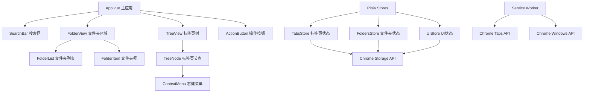
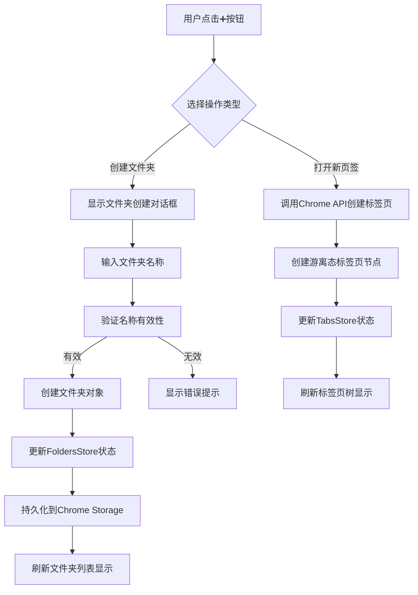
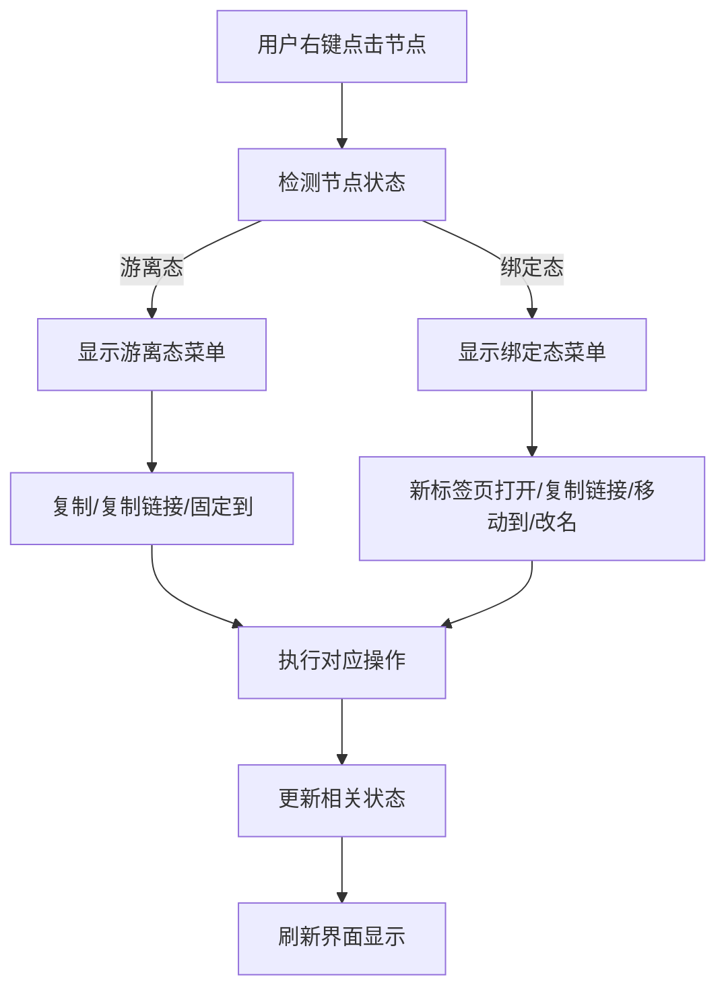

# 第二阶段功能技术设计文档

## 概述

**目的**: 本功能为Chrome树状标签管理器增加文件夹管理能力和增强的右键菜单功能，提供更强大的标签页组织和管理能力。

**用户**: 重度浏览器用户、研究人员、开发者将利用此功能进行更高效的标签页分类和组织管理。

**影响**: 改变当前单一的树状结构展示方式，引入文件夹概念，实现标签页的分层组织，同时增强用户交互体验。

### 目标
- 实现文件夹的创建、管理、持久化存储功能
- 提供增强的右键菜单，支持不同节点状态的差异化操作
- 调整UI布局，在搜索框与页面节点区之间插入文件夹区域
- 保持与现有架构的兼容性，最小化对现有功能的影响

### 非目标
- 不替代现有的树状结构功能
- 不涉及跨浏览器的文件夹同步
- 不提供文件夹的云端备份功能
- 不实现文件夹的权限管理

## 架构

### 现有架构分析
当前系统采用Vue3 + Pinia + TypeScript的现代化架构：
- **状态管理**: 使用Pinia管理标签页树状结构，`tabs.ts`包含1994行核心逻辑
- **组件架构**: TreeView和TreeNode组件提供树状展示功能
- **存储系统**: 基于chrome.storage.local的配置和状态持久化
- **类型系统**: 完整的TypeScript类型定义，确保类型安全

**集成约束**:
- 必须保持现有标签页树状结构的完整性
- 需要扩展现有的状态管理逻辑
- 必须兼容现有的Chrome API调用模式
- 保持现有测试框架的兼容性

### 高层架构



**架构集成**:
- 现有模式保持: Vue3 Composition API、Pinia状态管理、TypeScript类型系统
- 新组件理由: FolderView用于文件夹展示，ContextMenu用于右键菜单，ActionButton用于操作入口
- 技术对齐: 完全基于现有技术栈，无新增外部依赖
- 指导原则遵循: 保持代码组织模式、命名约定、测试策略的一致性

### 技术栈和设计决策

**技术对齐**: 完全基于现有Vue3 + Pinia + TypeScript技术栈，无需引入新的技术依赖。

**关键设计决策**:

**决策1**: 扩展现有TabsStore而非创建独立的FoldersStore
- **上下文**: 文件夹与标签页节点存在紧密的绑定关系，需要统一的状态管理
- **替代方案**: 创建独立FoldersStore、使用全局状态管理、采用事件驱动架构
- **选择方案**: 在现有TabsStore基础上扩展文件夹管理功能
- **理由**: 保持状态一致性，减少组件间通信复杂度，复用现有存储逻辑
- **权衡**: 获得统一状态管理，但Store文件会进一步增大

**决策2**: 使用组合类型而非继承扩展TabTreeNode
- **上下文**: 需要支持节点的绑定态和游离态两种状态
- **替代方案**: 创建新的FolderNode类型、使用继承扩展、采用装饰器模式
- **选择方案**: 通过组合类型和状态字段实现节点状态管理
- **理由**: 保持类型系统的简洁性，避免复杂的继承关系，便于状态切换
- **权衡**: 获得灵活的状态管理，但需要处理状态转换的边界情况

**决策3**: 采用组件化右键菜单而非原生浏览器菜单
- **上下文**: 需要支持不同节点状态的差异化菜单选项
- **替代方案**: 使用Chrome原生右键菜单、采用下拉菜单、使用模态对话框
- **选择方案**: 自定义Vue组件实现右键菜单
- **理由**: 提供更好的用户体验，支持复杂的交互逻辑，保持界面一致性
- **权衡**: 获得丰富的交互能力，但需要处理菜单定位和事件管理

## 系统流程

### 文件夹管理流程



### 右键菜单交互流程



## 需求可追溯性

| 需求 | 需求摘要 | 组件 | 接口 | 流程 |
|------|----------|------|------|------|
| REQ-FOLDER-001 | 文件夹创建和管理 | FolderView, ActionButton | createFolder, renameFolder, moveFolder, deleteFolder | 文件夹管理流程 |
| REQ-FOLDER-002 | 文件夹持久化存储 | FoldersStore | saveFolders, loadFolders | 数据持久化流程 |
| REQ-FOLDER-003 | 文件夹UI布局 | App.vue, FolderView | 布局调整 | UI布局流程 |
| REQ-CONTEXT-001 | 游离态节点右键菜单 | ContextMenu | showContextMenu | 右键菜单交互流程 |
| REQ-CONTEXT-002 | 绑定态节点右键菜单 | ContextMenu | showContextMenu | 右键菜单交互流程 |
| REQ-UI-001 | 左下角操作按钮 | ActionButton | showActionMenu | 操作按钮流程 |
| REQ-UI-002 | 文件夹右键菜单 | FolderItem, ContextMenu | handleFolderContextMenu | 文件夹右键菜单流程 |

## 组件和接口

### 状态管理层

#### FoldersStore

**职责与边界**
- **主要职责**: 管理文件夹的创建、更新、删除和持久化存储
- **域边界**: 文件夹管理域，与标签页管理域协作
- **数据所有权**: 文件夹结构、文件夹元数据、文件夹与节点的绑定关系
- **事务边界**: 文件夹操作的事务一致性，包括文件夹删除时的级联操作

**依赖关系**
- **入向**: FolderView组件、ActionButton组件、ContextMenu组件
- **出向**: TabsStore（用于节点绑定）、Chrome Storage API（用于持久化）
- **外部**: Chrome Extension API

**服务接口**
```typescript
interface FoldersService {
  // 文件夹CRUD操作
  createFolder(name: string, parentId?: string): Promise<Folder>;
  renameFolder(folderId: string, newName: string): Promise<void>;
  moveFolder(folderId: string, targetParentId?: string): Promise<void>;
  deleteFolder(folderId: string): Promise<void>;
  
  // 节点绑定操作
  bindNodeToFolder(nodeId: string, folderId: string): Promise<void>;
  unbindNodeFromFolder(nodeId: string): Promise<void>;
  moveNodeBetweenFolders(nodeId: string, targetFolderId: string): Promise<void>;
  
  // 查询操作
  getFolders(): Promise<Folder[]>;
  getFolderById(folderId: string): Promise<Folder | null>;
  getNodesInFolder(folderId: string): Promise<TabTreeNode[]>;
}
```

**前置条件**: 文件夹名称不能为空，不能与现有文件夹重名
**后置条件**: 文件夹操作成功后，相关状态已更新并持久化
**不变式**: 文件夹层级结构不能形成循环依赖

#### TabsStore扩展

**集成策略**: 扩展现有TabsStore，添加文件夹相关状态和方法

**修改方法**:
- 扩展TabTreeNode类型，添加folderId字段
- 添加节点状态管理（绑定态/游离态）
- 扩展存储逻辑，支持文件夹数据持久化
- 添加文件夹与节点的绑定/解绑方法

### 表示层

#### FolderView组件

**职责与边界**
- **主要职责**: 展示文件夹列表，处理文件夹的交互操作
- **域边界**: 文件夹展示域
- **数据所有权**: 文件夹的显示状态、展开/折叠状态
- **事务边界**: 文件夹的UI交互操作

**依赖关系**
- **入向**: App.vue主应用
- **出向**: FoldersStore（状态管理）、FolderItem组件（子组件）
- **外部**: 无外部依赖

**组件接口**
```typescript
interface FolderViewProps {
  folders: Folder[];
  onFolderClick: (folder: Folder) => void;
  onFolderContextMenu: (folder: Folder, event: MouseEvent) => void;
}

interface FolderViewEmits {
  'folder-selected': (folder: Folder) => void;
  'folder-context-menu': (folder: Folder, event: MouseEvent) => void;
}
```

#### ContextMenu组件

**职责与边界**
- **主要职责**: 根据节点状态显示相应的右键菜单选项
- **域边界**: 用户交互域
- **数据所有权**: 菜单的显示状态、位置信息
- **事务边界**: 菜单选项的点击处理

**依赖关系**
- **入向**: TreeNode组件、FolderItem组件
- **出向**: TabsStore、FoldersStore（执行菜单操作）
- **外部**: 无外部依赖

**组件接口**
```typescript
interface ContextMenuProps {
  visible: boolean;
  position: { x: number; y: number };
  nodeType: 'tab' | 'folder';
  nodeState: 'bound' | 'unbound';
  node: TabTreeNode | Folder;
}

interface ContextMenuEmits {
  'menu-action': (action: string, node: TabTreeNode | Folder) => void;
  'menu-close': () => void;
}
```

#### ActionButton组件

**职责与边界**
- **主要职责**: 提供创建文件夹和打开新标签页的操作入口
- **域边界**: 用户操作域
- **数据所有权**: 按钮状态、下拉菜单状态
- **事务边界**: 用户操作的处理

**依赖关系**
- **入向**: App.vue主应用
- **出向**: FoldersStore、TabsStore（执行操作）
- **外部**: Chrome Tabs API（创建新标签页）

**组件接口**
```typescript
interface ActionButtonProps {
  position: 'bottom-left' | 'bottom-right';
}

interface ActionButtonEmits {
  'create-folder': () => void;
  'create-tab': () => void;
}
```

## 数据模型

### 域模型

**核心概念**:
- **文件夹聚合**: 文件夹及其包含的节点和子文件夹的完整集合
- **节点实体**: 标签页节点，具有唯一标识和生命周期
- **绑定关系值对象**: 节点与文件夹的绑定关系，不可变
- **域事件**: 文件夹创建、节点绑定/解绑等重大状态变化

**业务规则与不变式**:
- 文件夹名称在父文件夹内必须唯一
- 文件夹不能移动到自身或子文件夹下
- 节点只能绑定到一个文件夹
- 删除文件夹时必须处理其包含的所有节点和子文件夹

### 逻辑数据模型

**文件夹结构定义**:
```typescript
interface Folder {
  id: string;
  name: string;
  parentId?: string;
  children: Folder[];
  boundNodes: TabTreeNode[];
  createdAt: number;
  updatedAt: number;
}

interface NodeBinding {
  nodeId: string;
  folderId: string;
  boundAt: number;
}

interface FolderHierarchy {
  rootFolders: Folder[];
  nodeBindings: Map<string, string>; // nodeId -> folderId
}
```

**一致性与完整性**:
- 文件夹层级结构必须形成有向无环图
- 节点绑定关系必须保持一致性
- 文件夹删除时必须级联处理子文件夹和绑定节点

### 物理数据模型

**Chrome Storage Schema**:
```typescript
interface FolderStorageSchema {
  'folder-hierarchy': {
    folders: SerializedFolder[];
    nodeBindings: Record<string, string>;
    metadata: {
      version: string;
      lastSaved: number;
      folderCount: number;
    };
  };
}

interface SerializedFolder {
  i: string;           // id
  n: string;           // name
  p?: string;          // parentId
  c: string[];         // children ids
  b: string[];         // bound node ids
  ct: number;          // createdAt
  ut: number;          // updatedAt
}
```

**存储策略**:
- 使用chrome.storage.local存储文件夹数据
- 采用压缩序列化格式减少存储空间
- 实现增量更新机制，避免全量同步

## 错误处理

### 错误策略
采用分层错误处理策略，从用户操作层到数据持久化层提供完整的错误恢复机制。

### 错误类别和响应
**用户错误** (4xx): 无效文件夹名称 → 字段级验证提示；重复名称 → 建议替代名称；无效操作 → 操作引导
**系统错误** (5xx): 存储失败 → 本地缓存降级；API调用失败 → 重试机制；内存不足 → 数据清理
**业务逻辑错误** (422): 循环依赖 → 依赖关系说明；权限不足 → 操作权限提示；状态冲突 → 状态同步

### 监控
实现错误跟踪、日志记录和健康监控：
- 使用Chrome Extension的日志系统记录错误
- 实现错误统计和报告机制
- 提供用户友好的错误提示和恢复建议

## 测试策略

### 单元测试
- **文件夹CRUD操作**: 创建、重命名、移动、删除文件夹的测试
- **节点绑定操作**: 绑定、解绑、移动节点的测试
- **状态管理逻辑**: FoldersStore和TabsStore扩展的测试
- **右键菜单逻辑**: 不同节点状态的菜单显示测试
- **数据持久化**: Chrome Storage API的存储和读取测试

### 集成测试
- **文件夹与标签页交互**: 文件夹操作对标签页树的影响测试
- **UI组件集成**: FolderView、ContextMenu、ActionButton的交互测试
- **状态同步**: 多个Store之间的状态同步测试
- **Chrome API集成**: 扩展API调用的集成测试

### E2E测试
- **完整用户流程**: 创建文件夹 → 绑定节点 → 管理文件夹的完整流程
- **右键菜单操作**: 不同节点状态的右键菜单操作流程
- **数据持久化**: 浏览器重启后的数据恢复测试
- **性能测试**: 大量文件夹和节点的渲染性能测试

## 安全考虑

### 数据保护
- 文件夹数据仅在本地存储，不涉及网络传输
- 实现数据加密存储，保护用户隐私
- 防止恶意脚本注入，使用CSP策略

### 权限控制
- 最小化Chrome API权限使用
- 实现操作权限验证，防止越权操作
- 提供用户数据导出和清理功能

## 性能与可扩展性

### 目标指标
- 文件夹创建响应时间 < 100ms
- 大量文件夹（100+）时的渲染性能保持流畅
- 存储数据占用 < 1MB
- 内存使用增长 < 10MB

### 扩展方法
- 实现虚拟滚动支持大量文件夹
- 采用懒加载策略，按需加载文件夹内容
- 实现数据分页和缓存机制

### 缓存策略
- 文件夹结构的内存缓存
- 节点绑定关系的快速查找索引
- 增量更新机制，减少存储操作频率
