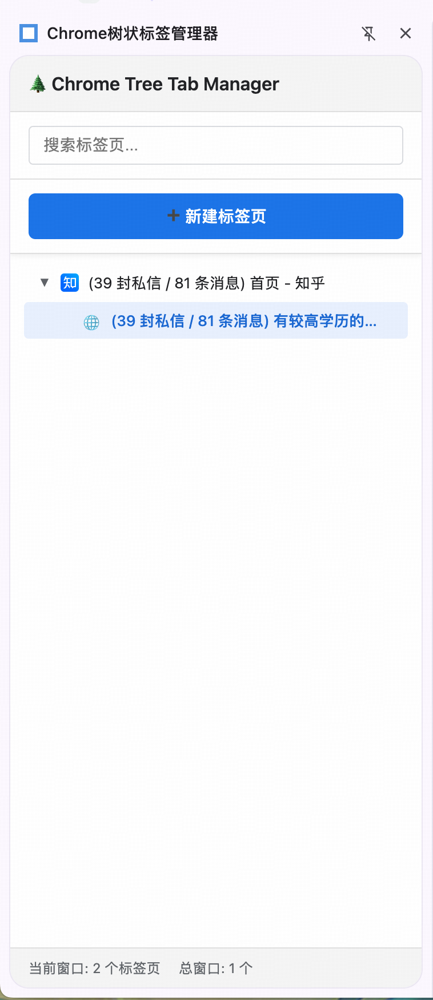
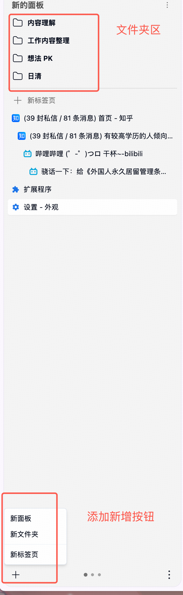

# 第二阶段需求
概述： 主要增加文件夹功能。页签节点增加右键的功能

# 文件夹功能
项目当前样式 
在 参考样图  

# 主要改动点
在 搜索框与 页面节点区（当前展示页面节点的位置）中间插入一个文件区域
文件区为创建的文件夹， 文件夹可以存放页面节点与文件夹。 
在插件的左下角 添加 ➕ ， 有两个选项： 创建文件夹 打开新页签
    功能说明： 创建文件夹为 新增一个文件夹在文件区
    打开新页签为 打开一个空白页面 该页面无父节点

## 文件夹
文件夹区的文件 鼠标右击 有  重命名、移动到、删除 三个选项
功能说明：
1. 重命名： 对文件夹改名
2. 移动到： 将文件夹移动到某一文件夹下面， 注意不能移动到 当前文件夹与子文件夹中。  选择移动到时 会展示所有创建的文件夹列表，其中需要过滤当前文件夹以及下游的所有文件夹。 
3. 删除：删除文件夹当前所有绑定的页面节点与子文件夹

文件夹中的文件夹与页面节点设置为永久保存 当下次打开浏览器时自动展示，但是页面节点不必打开页面
文件夹中的页面节点的子节点不是永久保留

## 页面节点
节点状态定义：
    绑定态： 节点与文件夹直接绑定
    游离态：节点不与文件夹直接绑定

页面节点 新增右键功能， 
游离态的节点 右键后有如下功能： 复制、复制链接、固定到
绑定态的节点 右键后有如下功能： 新标签页打开、复制链接、移动到、改名

功能说明：
1、复制链接：复制页面节点的 http 地址
2、固定到：点击后列出文件夹列表，选择文件夹名后，将当前节点固定到文件夹中
3、移动到：点击后列出文件夹列表（忽略页面节点所在的文件夹），选择文件夹名后，将当前节点从当前文件夹移动到选择的文件夹
4、复制：使用当前节点的链接，创建子节点
5、新标签页打开：使用当前的节点的链接打开新的页签
6、改名：修改节点的显示的名称。

